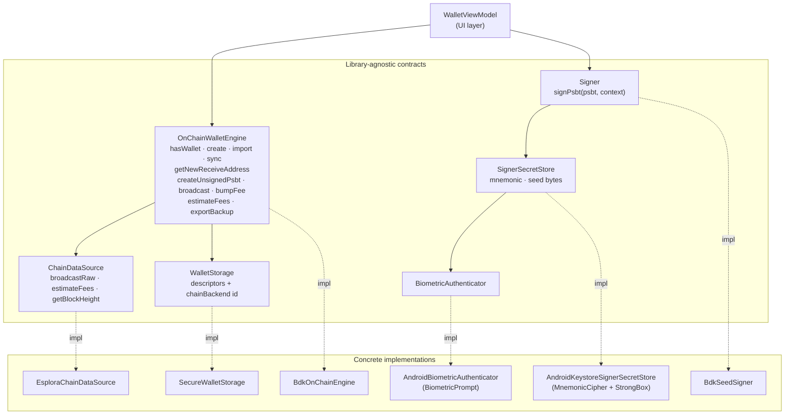
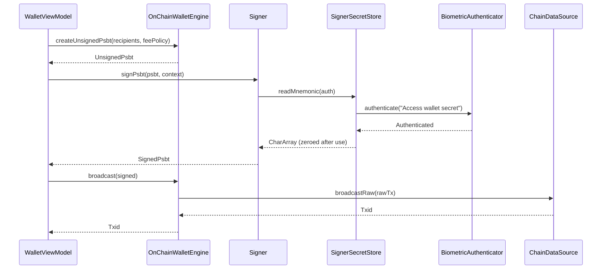
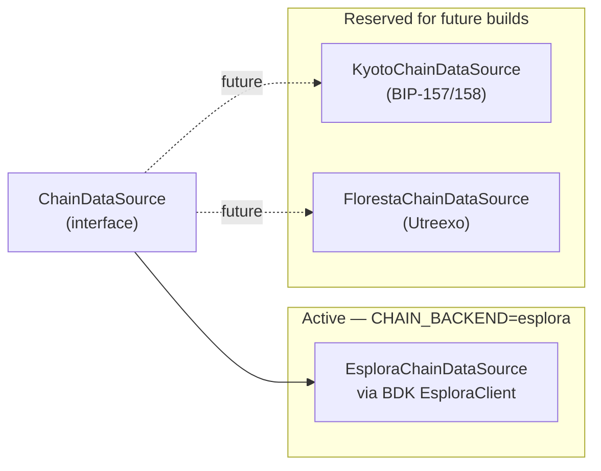

# POS SatStack

Software for Android-based POS machines, providing a simple, secure, and private way for small merchants to charge and receive Bitcoin payments across all layers (on-chain, Lightning, etc).

## Motivation

Small merchants often face barriers to accepting Bitcoin as a payment method. POS SatStack aims to remove those barriers by offering a solution that runs directly on the Android POS machines already used day-to-day, with no additional hardware required.

## Architecture

The app is built with **Kotlin + Jetpack Compose** and follows a layered architecture:

- **UI layer** — Compose screens, Material3, follows the system theme (light/dark)
- **Wallet abstraction layer** — three neutral contracts (`OnChainWalletEngine`, `Signer`, `ChainDataSource`) shield every ViewModel, Service, and screen from the concrete Bitcoin library. Swapping the chain backend (Esplora ↔ Kyoto ↔ Floresta) or the wallet engine is localised to a single `@Binds` change in `WalletModule` plus a Gradle dep flip.
- **Bitcoin implementation** — powered by [BDK Android](https://github.com/bitcoindevkit/bdk-android) 2.x (BDK 1.x Rust core), using BIP-84 native SegWit descriptors.

### Wallet abstractions

The wallet stack is split into five orthogonal contracts. Every ViewModel talks only to the contracts (grey boxes below); the concrete implementations (white boxes) are wired by Hilt and can be swapped in one place.



- **`OnChainWalletEngine`** — the public surface for wallet ops. Never signs; only builds PSBTs and broadcasts. This keeps hardware signers (TAPSIGNER, airgap QR) pluggable later without touching the engine.
- **`Signer`** — signs unsigned PSBTs. Today only `BdkSeedSigner` (software seed + biometric gate); future `TapsignerNfcSigner` slots in as an additional `@Binds`.
- **`ChainDataSource`** — talks to the network: broadcast raw tx, ask for fees, query chain tip. See "Chain backend swap" below.
- **`WalletStorage`** + **`SignerSecretStore`** — two separate encrypted prefs files. Descriptors live in the former with a standard `MasterKey`; the mnemonic lives in the latter wrapped by a dedicated AndroidKeyStore AES-GCM key with `setUserAuthenticationRequired(true)` and a 30s validity window.
- **`BiometricAuthenticator`** — `BiometricPrompt` with `BIOMETRIC_STRONG | DEVICE_CREDENTIAL`. Invoked lazily by the secret store whenever the Keystore demands a fresh user-presence signal.

#### Send flow



#### Chain backend swap (dev-time)

Only **one** `ChainDataSource` is compiled per build. Swapping is a dev-only operation — no runtime toggle, no UI.



To swap to Kyoto or Floresta later:

1. Uncomment the target dep in [`gradle/libs.versions.toml`](gradle/libs.versions.toml).
2. Flip the `implementation(...)` line and the `buildConfigField("CHAIN_BACKEND", ...)` in [`app/build.gradle.kts`](app/build.gradle.kts).
3. Change the `bindChainDataSource` binding in [`WalletModule`](app/src/main/java/com/possatstack/app/di/WalletModule.kt).
4. On first run the engine detects the new `CHAIN_BACKEND`, wipes the BDK SQLite cache, and forces a fresh full scan. The mnemonic and any future LDK Node state are never touched by the swap.

### Wallet module structure

```
wallet/
  WalletNetwork.kt                     — network enum
  WalletDescriptor.kt                  — external/internal descriptor + network
  BitcoinAddress.kt                    — value class for Bitcoin addresses
  WalletTransaction.kt                 — lightweight tx model for the UI
  SyncProgress.kt                      — sync state (Idle, FullScan, Syncing)
  OnChainWalletEngine.kt               — main contract
  WalletBackup.kt                      — sealed backup payloads (Bip39, Xpub, SCB, …)
  WalletError.kt                       — neutral error hierarchy
  FeePolicy.kt / PsbtTypes.kt          — fee + PSBT value types
  bitcoin/
    BdkOnChainEngine.kt                — BDK 2.x implementation
    BdkErrors.kt                       — org.bitcoindevkit.* → WalletError
  chain/
    ChainDataSource.kt                 — interface
    EsploraChainDataSource.kt          — active backend (via BDK EsploraClient)
  signer/
    Signer.kt / SigningContext.kt      — signer contract
    BdkSeedSigner.kt                   — software seed + biometric
    SignerSecretStore.kt               — mnemonic contract
    AndroidKeystoreSignerSecretStore.kt— StrongBox + auth-required
    MnemonicCipher.kt                  — dedicated Keystore AES-GCM key
    BiometricAuthenticator.kt          — prompt contract
    AndroidBiometricAuthenticator.kt   — BiometricPrompt impl
    ActivityHolder.kt                  — weak ref to the resumed FragmentActivity
  storage/
    WalletStorage.kt                   — descriptor persistence contract
    SecureWalletStorage.kt             — EncryptedSharedPreferences impl
```

### Security

- **Mnemonic** lives in a dedicated `mnemonic_secure_prefs` file, double-wrapped: the prefs file itself is encrypted by a non-auth-required `MasterKey`, and the mnemonic payload inside is encrypted again by a separate AndroidKeyStore AES-GCM key with `setUserAuthenticationRequired(true)` and a 30-second validity window. Reading the mnemonic therefore always requires a recent biometric/PIN prompt via [`BiometricPrompt`](https://developer.android.com/reference/androidx/biometric/BiometricPrompt). StrongBox is attempted first, falling back to TEE.
- **Descriptors** live in a separate `wallet_secure_prefs` file, encrypted at rest by a standard `MasterKey`. Reads do not prompt the user (no need — descriptors are accessed on every boot).
- **Wallet SQLite cache** is stored under `noBackupFilesDir/bdk/` so it is excluded from Android cloud backup. `noBackupFilesDir/ldk/` is reserved for the future Lightning node state.
- **`allowBackup="false"`** plus explicit [`data_extraction_rules.xml`](app/src/main/res/xml/data_extraction_rules.xml) block both secure prefs files from cloud backup and device transfer.
- QR codes are generated locally using ZXing — no data leaves the device.

## Features

### Wallet management
- Create a new BIP-84 (native SegWit) wallet with a 12-word seed phrase
- Import an existing wallet from a 12 or 24-word mnemonic
- View and back up the seed phrase
- Delete the wallet from the device

### Receive
- Generate new receive addresses
- Display address as a QR code (ZXing) for easy scanning
- Copy address to clipboard

### Transaction history
- List all wallet transactions grouped by date
- Unconfirmed (pending) transactions appear in a dedicated section at the top
- Each transaction shows direction (sent/received), amount, txid, and block height
- Tap a transaction to view it on [mempool.space](https://mempool.space) (supports signet, testnet, and mainnet)

### Sync
- Esplora-based synchronization via BDK's built-in `EsploraClient`
  - **Signet**: `https://mempool.space/signet/api`
  - **Mainnet**: `https://blockstream.info/api`
  - **Testnet**: `https://blockstream.info/testnet/api`
- Automatic sync on app start via `WalletSyncService`
- Full scan for first-time or imported wallets; incremental sync thereafter
- Forced full scan when `CHAIN_BACKEND` changes between builds (dev-time swap between Esplora / Kyoto / Floresta)
- Global progress indicator visible across all screens
- Balance display (BTC + sats) with manual refresh

### Logging
- Custom `AppLogger` utility with info, warning, and error levels
- Logs are emitted only in debug builds — silent in production

## Requirements

- Android 8.0+ (API 26)
- Android-based POS machine or any Android device for development/testing

## Tech Stack

| Layer | Technology |
|---|---|
| Language | Kotlin |
| UI | Jetpack Compose + Material3 |
| Navigation | Navigation Compose 2.8 (type-safe routes) |
| DI | Hilt 2.54 + KSP |
| Bitcoin wallet | BDK Android 2.3.1 |
| Chain backend | Esplora (via BDK `EsploraClient`); Kyoto / Floresta reserved as swap targets |
| Secure storage | EncryptedSharedPreferences (security-crypto 1.1.0-alpha06) |
| Biometric | `androidx.biometric` 1.2.0-alpha05 + AndroidKeyStore auth-required key |
| QR code | ZXing Core 3.5.3 |
| Serialization | kotlinx-serialization |

## Roadmap

### Phase 1 — Proof of Concept ✅
- Android app installable on POS machines
- Home screen with Charge and Settings actions
- Wallet abstraction layer with BDK integration
- Create, import, and delete wallet
- Generate receive addresses with QR code
- Electrum sync (full scan + incremental)
- Balance display and transaction history
- Secure storage for seed phrases and descriptors

### Phase 2 — NFC + SatsCard
- NFC integration for charging via [SatsCard](https://satscard.com/)
- Tap-to-pay flow for a seamless point-of-sale experience

### Phase 3 — Field Testing
- Pilot with selected merchants
- Feedback collection and iteration on user experience

## License

This project is licensed under the MIT License. See the [LICENSE](LICENSE) file for details.
