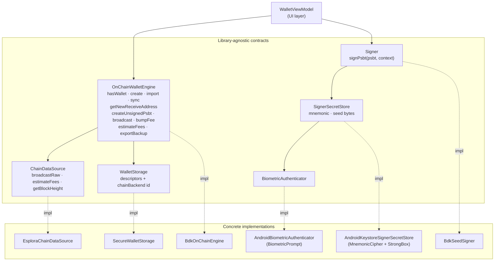
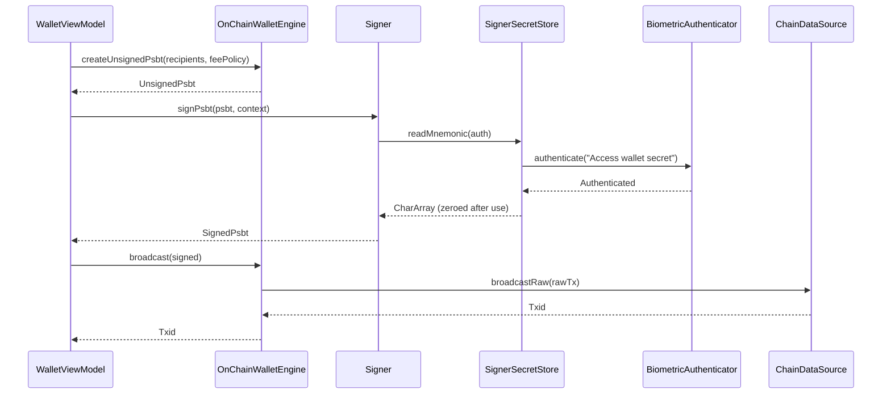
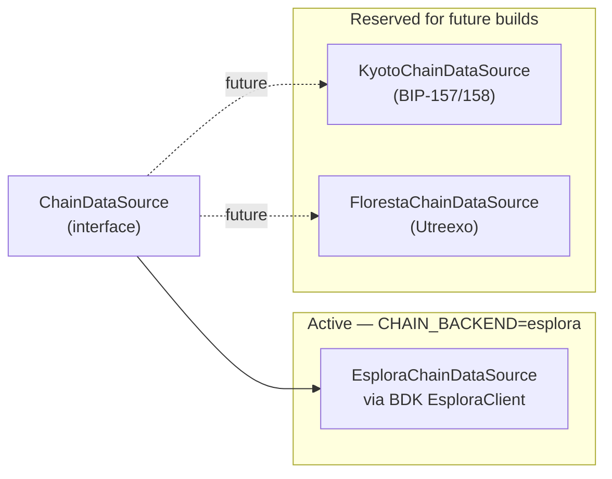

# Wallet Architecture

This document describes how the on-chain wallet stack is wired: the
library-agnostic contracts, the current concrete implementations, the
per-transaction flow, and the procedure for swapping the chain backend
(Esplora ↔ Kyoto ↔ Floresta) at dev time.

For a feature-level overview of the app, see the main [README](../README.md).

---

## Contracts and implementations

The wallet stack is split into six orthogonal contracts. Every ViewModel
talks only to the contracts (grey boxes below); the concrete
implementations (white boxes) are wired by Hilt and can be swapped in
one place.

- **`OnChainWalletEngine`** — the public surface for wallet ops. Never
  signs; only builds PSBTs and broadcasts. Keeps hardware signers
  (TAPSIGNER, airgap QR) pluggable later without touching the engine.
- **`Signer`** — signs unsigned PSBTs. Today only `BdkSeedSigner`
  (software seed + biometric gate); future `TapsignerNfcSigner` slots
  in as an additional `@Binds`.
- **`ChainDataSource`** — talks to the network: broadcast raw tx, ask
  for fees, query chain tip. See "Chain backend swap" below.
- **`WalletStorage`** + **`SignerSecretStore`** — two separate encrypted
  prefs files. Descriptors live in the former with a standard
  `MasterKey`; the mnemonic lives in the latter wrapped by a dedicated
  AndroidKeyStore AES-GCM key with `setUserAuthenticationRequired(true)`
  and a 30s validity window.
- **`BiometricAuthenticator`** — `BiometricPrompt` with
  `BIOMETRIC_STRONG | DEVICE_CREDENTIAL`. Invoked lazily by the secret
  store whenever the Keystore demands a fresh user-presence signal.

---

## Send flow

---

## Chain backend swap (dev-time)

Only **one** `ChainDataSource` is compiled per build. Swapping is a
dev-only operation — no runtime toggle, no UI.

To swap to Kyoto or Floresta later:

1. Uncomment the target dep in [`gradle/libs.versions.toml`](../gradle/libs.versions.toml).
2. Flip the `implementation(...)` line and the `buildConfigField("CHAIN_BACKEND", ...)` in [`app/build.gradle.kts`](../app/build.gradle.kts).
3. Change the `bindChainDataSource` binding in [`WalletModule`](../app/src/main/java/com/possatstack/app/di/WalletModule.kt).
4. On first run the engine detects the new `CHAIN_BACKEND`, wipes the
   BDK SQLite cache under `noBackupFilesDir/bdk/`, and forces a fresh
   full scan. The mnemonic and any future LDK Node state
   (`noBackupFilesDir/ldk/`) are never touched by the swap.
